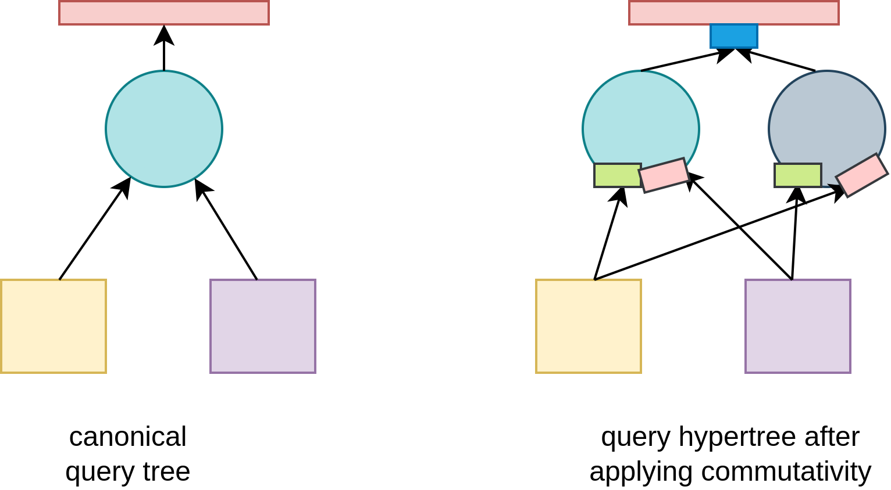
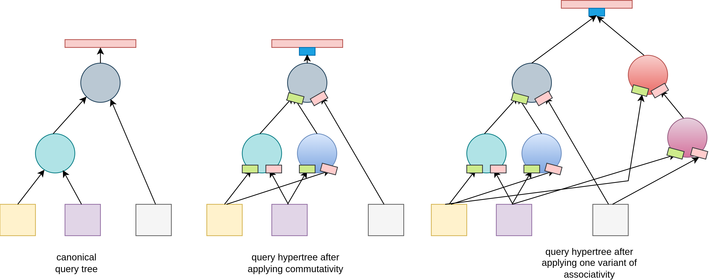
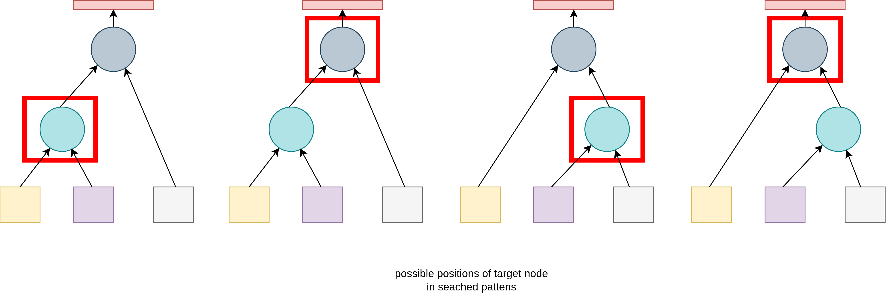

# DP Bora - transformation-based optimizers strike again!

## Introduction

DP Bora is a novel algorithm for optimization of SQL queries.
It is closely based on DP SUBE, so readers are advised to read the DP SUBE
paper first. DP Bora dispoves three thesis present in DP SUBE paper:

1. Transformation-based optimizers are not efficient because they consume a lot of memory
2. Transformation-based optimizers generate exponential number of duplicates
3. Transformation-based optimizers generate invalid transformations that are discarded later

Current limitations are overcome by innovative data structure called **query hypertree**,
which describes complete combinatorial search space in a compact and duplicate-free representation
suitable for use in both top-down (memoization) and bottom-up (dynamic programming) optimizers.

DP Bora enumerates complete search space (all possible bushy trees) and supports arbitrary joins and arbitrary predicates.
Extension of DP SUBE is that arbitrary transformations are also supported by the algorithm and it's main
internal data structure.

DP Bora comes with a reference implementation to alleviate all possible ambiguities present in the text
and to provide additional information necessary for production-grade implementation.

Author strongly believes that complex (i.e. hard to understand and truly prove) mathematical proofs
and absence of reference implementations lead to general disregard to computer science from
industry-oriented team members. DP Bora aims to overcome discrepancy between theory and practice.

## Query hypertree

Query hypertree presents a generalization of canonical query tree. Every node has associated operator and sets
of possible left and right inputs. Inputs are always a function over a set of originating relations. Every member
of input sets is a valid function that has an equivalent output result.

Every path taken in the query hypertree is valid, and problem query optimization is equivalent to
finding the path with the lowest cost.
Every node has it's cost function based on output parameters from input costs. To find the lowest cost,
it is necessary to find lowest cost left and right inputs. For every element of the according input set, 
cost is calculated, and the lowest cost element is selected.

As DP Bora constructs valid paths only, main premise of dynamic programming that every sub-solution of an optimal
solution is optimal, caching results using memoization or DP table is possible.

## Algorithm outline

1. Canonical query tree is constructed directly from the SQL query
2. All initially present operator nodes are addded to the worklist
3. For every node in the worklist, every possible transformation is attempted
4. Transformation output is stored in query hypertree as an alternative path that does not affect originally present paths
5. After performing all possible transformations, a node is removed from the worklist
6. All newly created (i.e. transformed) nodes are added to the worklist
7. If a transformation attemts to create a node that is present, existing equivalent node is reused
8. Nodes are considered equivalent if they have the same operator and same input relations on the left side and on the right side
9. When worklist becomes empty, complete search space was enumerated
10. Query hypertree is used to calculate the cheapest path using either memoization or dynamic programming

## Supported transformations and node equivalence

DP Bora supports all transformations described in the DP SUBE paper: *commutativity*, *associativity*,
*l-asscom* and *r-asscom*. DP Bora uses the same matrices and predicates from DP SUBE paper to
check whether a transformation can be applied to a subtree. DP Bora does not use *conflict representation set* calculation.

Instead, transformations are applied (if possible) and added as possible alternative paths in the
**query hypertree**. Instead of resolving conflicts, DP Bora attemts all possible transformations
over all possible paths using duplicate-prevention strategy based on operator equivalence.

Separate map-based structure holds pairs of tuples `(operator, left_relation_set, right_relation_set)` and **query hypernodes**.
When a transformation attemts to create a node, `equivalent_nodes` map is searched for existence of
the needed node. If needed node exists, it is picked. Otherwise, a new node is constructed and added
to the `equivalent_nodes` map. Left and right inputs are stored as sets, so adding duplicate
paths is prevented as well. Using reference/memory address equivalence in sets is sufficient,
as duplicate construction (previous step) is prevented using a robust approach.

DP Bora can be extended to support arbitrary node transformations as long as they can support duplicate prevention
mechanisms described above.

## Worklist item processing

For transformations that need to examine only one operator node (i.e. commutativity), only operator applicability
and equivalent node existence need to be performed.

For transformations that examine two operator nodes (i.e. associativity, l-asscom and r-asscom), a more sophisticated
analysis is required. Need for this arises from the fact that when analyzing subtree hierarchy, we can be looking
at either the left or the right operator present in the same searhed pattern.

This problem is not present in the first pass that analyzes canonical tree, but is necessary in other successive passes,
as in general case it is not possible to know in which direction should transformation be attempted, so all
possibilities need to be taken into account.

# Unification and stratification of physical plan generation

Reference implementation works only on logical operators. To implement a production-grade optimizer based on
DP Bora, logical operators must be transformed to physical operators. Sorting of input always affects both the
cost and possible applicability of physical operators (i.e. merge join and it's derivatives). It is possible to
extend DP Bora to add necessary sort operators to alternate query hypertree paths using either **unified** (i.e. generate
all physical plans in one step) or **stratified** (i.e. generate possible physical plans after all logical plans) approach.

# Restriction of the search space

DP-based algorithms over bushy trees provide absolute optimal query plans, assuming that cost functions (and mainly
cardinality estimators) are sufficiently precise. However, they take exponentially more steps as the number of
input relations grows. Many heuristics for transforming canonical trees based on detected query patterns (such as
star queries) exist.

It is possible to modify DP Bora to restrict search space by restricting applied transformation as the number of
input relations grows, as the list of transformations is configurable. However, picking needed transformations still
remains a heuristic, but DP benefits are not completely discarded. Practical applicability of such approach
needs further analysis.